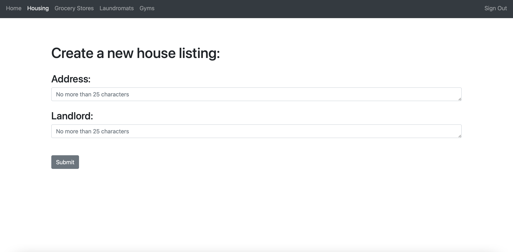
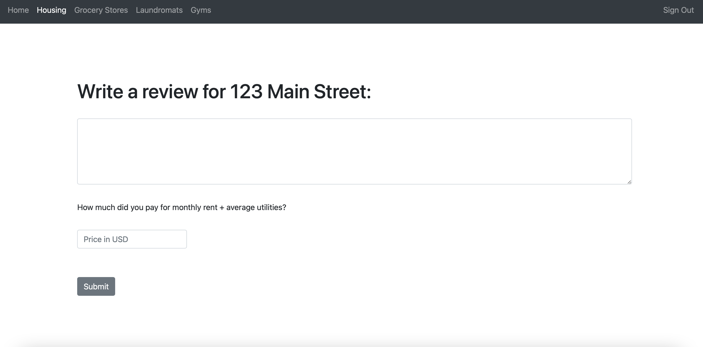

Title: Omicron

Subtitle: Amherst Reviews

Semester: Fall 2020

Overview: This application offers five college students living off campus to access reviews on housing units, gyms, grocery stores, and laundromats in the area. Our application offers a unique service because it provides all reviews written by students, for students. 

Team Members: Ryan Loofbourrow (GitHub: Ryan-Loofy), Nadia L’Bahy (GitHub: nlbahy), Jason Canterbury (GitHub: jcanterbury1)

User Interface:

Login page - Allows users to login with an existing account, or navigate to the make new account or delete account pages.

New account page- This page allows a new user to create an account.

Delete account page- This page allows users to delete their accounts.

Home page- Shows trending locations in each category. It contains a navigation bar that links to pages of listings for each category.

Listings pages- Contains a list of locations sorted by number of likes. Allows users to like each location, read reviews, write reviews, and search for a specific location. There is one for each category.

Read review page- Contains a list of all written reviews for a specific location. There is one for each category.

New listing page- Allows users to add a new listing for a given category. There is one for each category.

Write review ($ value)- For grocery stores only, allows users to submit a review with a relative price rating.

Write review (actual cost)- For other categories excluding grocery stores, allows users to submit a review with a hard price value.

Database:
Users table: contains all the accounts
| Column       | Data Type | Description               |
|--------------|-----------|---------------------------|
| Username     | String    | The username of a user    |
| Hash         | String    | The encrypted password    |
| Salt         | String    | The salt of a user        |

Reviews table: keeps track of all the reviews written for all categories
| Column       | Data Type | Description                                    |
|--------------|-----------|------------------------------------------------|
| Category     | String    | The type of service                            |
| Id           | String    | The id of the listing                          |
| Description  | String    | The review left by user                        |
| Price        | int       | The cost/relative expense                      |
| Username     | String    | The username of the person who wrote the review| 

Grocery Listings table: contains all the listings for the grocery store category
| Column       | Data Type | Description                        |
|--------------|-----------|------------------------------------|
| Name         | String    | The name of the listing            |
| Address      | String    | The address of the listing         |
| Likes        | int       | The amount of likes for the listing|

Gym Listings table: contains all the listings for the gym category
| Column       | Data Type | Description                        |
|--------------|-----------|------------------------------------|
| Name         | String    | The name of the listing            |
| Address      | String    | The address of the listing         |
| Likes        | int       | The amount of likes for the listing|

Housing Listings table: contains all the listings for the housing category
| Column       | Data Type | Description                        |
|--------------|-----------|------------------------------------|
| Address      | String    | The address of the listing         |
| Landlord     | String    | The landlord who owns the listing  |
| Likes        | int       | The amount of likes for the listing|

Laundromat Listings table: contains all the listings for the laundromat category
| Column       | Data Type | Description                        |
|--------------|-----------|------------------------------------|
| Name         | String    | The name of the listing            |
| Address      | String    | The address of the listing         |
| Likes        | int       | The amount of likes for the listing|

Likes table: contains each user and whether or not they have liked a listing
| Column       | Data Type | Description                                |
|--------------|-----------|--------------------------------------------|
| Username     | String    | The usernames of all the users             |
| All Listings | String    | Columns of all the listings where a boolean|
|              |           | determines if a user liked a listing       |

Authentication/Authorization: 
When a user creates an account, their password is hashed and stored into a database with their unique username. In addition, each user is randomly assigned a salt that is also stored into the database with their username and hashed password. When a user is not logged in, the only pages they can access are the login page, the registration page, and the delete account page. When the user logs in with an incorrect password they are redirected to the login page and not logged in. When the user logs in with the correct password, they can access any of the pages except for the login page or registration page. A password is authenticated by being hashed and added together with the user's salt and, if this matches the database, the user is authenticated.

Division of Labor:
Ryan:
Pages created: Login, Create Account, Delete Account, Home
Endpoints: /login, /register, /delete, all routing endpoints
Databases: Users
User Authentication
Nadia:
Pages created: Grocery Write Review, Gym Write Review, Housing Write Review, Laundromat Write Review
Endpoints: /writeReview
Databases: Reviews
Jason:
Pages created: Grocery Listings, Gym, Listings, Housing Listings, Laundromat Listings, Grocery New Listing, Gym New Listing, Housing New Listing, Laundromat New Listing, Grocery Read Reviews, Gym Read Reviews, Housing Read Reviews, Laundromat Read Reviews
Endpoints: all /getListings endpoints,  all /addListings endpoints, all /getReview endpoints, /getPrice, /getTrending, /likeListing
Databases: Grocery Listings, Gym Listings, Housing Listings, Laundromat Listings, Likes

Conclusion:
Overall, this project was a great experience. It showcased all that we have learned this semester and allowed us to put it all together and create something from scratch.The one thing we did learn was more about SQL when creating the databases. It was a little difficult trying to coordinate who would do what work. Even though we were working in different files most of the time, some parts of the project couldn’t be done until someone else had finished the part. I think if we had known that at the beginning we would have better divided up the work so that we only built off of what we ourselves had done.
